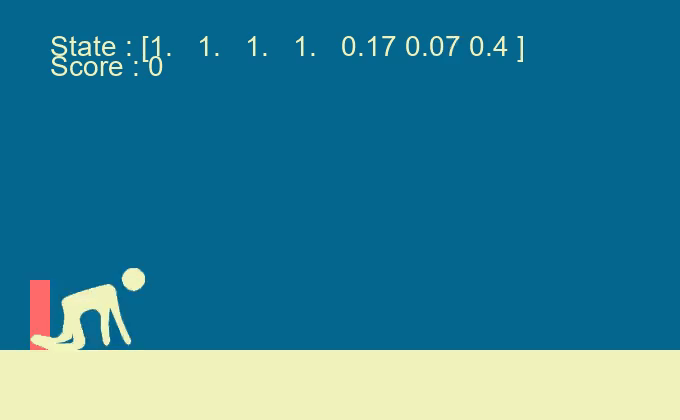

# HideOrJump

## Introduction 

The aim of this project is to develop a Python environment for a 2D game similar to the dinosaur game we can play on GoogleChrome when we don't have access to the Internet. 

The aim of this project is to code several methods for learning to play this game. 
With the aim of making a video to show different Reinforcement learning techniques to the general public, I've tried to add a few design elements. I've also kept to the graphic guidelines I usually use on my videos. 

## The game

### Playing the game

You can modify most game parameters in the utils file, in the GameParameters class. If you want to play the game yourself, you can run the Python file game.py

### The Reinforcement Learning environment

The RL environment is classically structured, with a reset function that resets the board and returns states, and a step function, which plays a move from an action, and returns 'next_state, reward, game_over, {}'. 

At each step, an agent's reward is +1 if it has just passed an obstable, -1 if it has just died, and 0 the rest of the time. 

There are 7 observations: 
- Position of next obstacle
- Height of next obstacle
- Position of next obstacle
- Height of next obstacle
- Agent's vertical position
- Agent width
- Current game speed

All these observations are continuous, and normalized to lie between 0 and 1.

There are 3 actions:
- Do nothing
- Jump
- Bending down

Le score que nous souhaitons atteindre est de 50 points. 

## Reinforcement Learning methods

### Genetic algorithms

The code for the genetic algorithm is available in the "genetic.py" file. The parameters of this code are also available in the utils file, in the "GeneticAgentParameters" class. 
This code is made up of two classes:
- a NeuralAgent class, corresponding to a single agent playing the game. This class is mainly composed of a neural network that enables play at each stage, and a score that saves rewards at the end of the game. 
- another GenerationManager, which stores all the agents and makes them evolve.

Learning works as follows:
1. Play all agents
2. Rank them in descending order of score
3. Make them evolve
4. We stop learning if we've exceeded the maximum number of generations we've set ourselves, or if we've reached our target score. 

Neural networks are simply composed of two hidden layers, each of size 24. To evolve a neural network, we randomly change a fixed number of weights. 

The evolution is performed as follows:
1. For the first 25% agents, nothing is changed 
2. For the next 25%, 2% of the neural network's weights are mutated.
3. For the next 25%, we mutate 4% of the neural network weights.
4. For the next 25%, we mutate 9% of the neural network weights.

You can change these parameters in the 'GeneticAgentParameters' class.

To be able to compare each agent effectively, we make them all play on the same world, every generation. This limits bias, such as an agent constantly bending down, who might get a good score if the first obstacles are all high. In fact, to speed up learning, we have carried out all training on a single world. If an agent achieves the target score, we then test it on other worlds to check that our agent is working properly and hasn't just learned the training world "by heart". To avoid this, we could also have cumulated the rewards between the different worlds with a gamma learning rate.

The number of generations required for our algorithm to work is highly variable, but it generally takes less than 80 generations. The result is very positive. You can record the gameplay of an agent by modifying the RENDER_GAMEPLAY parameter of GeneticAgentParameters. Here's a gif of an agent that beat the game:

